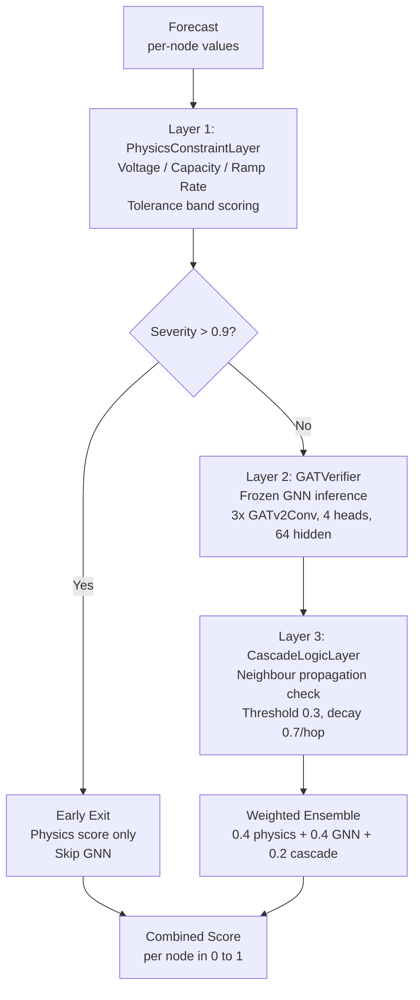
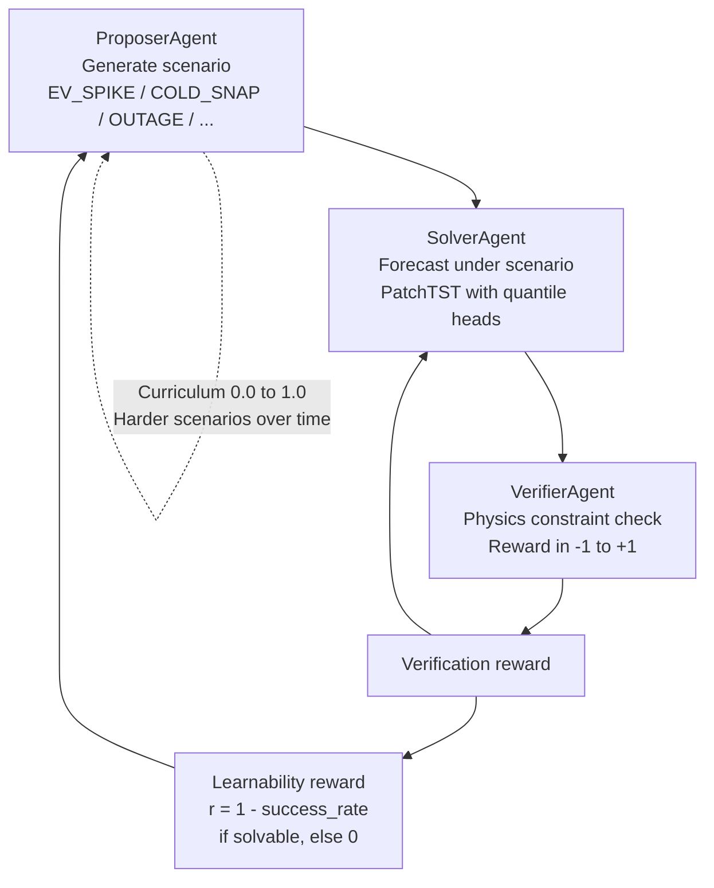
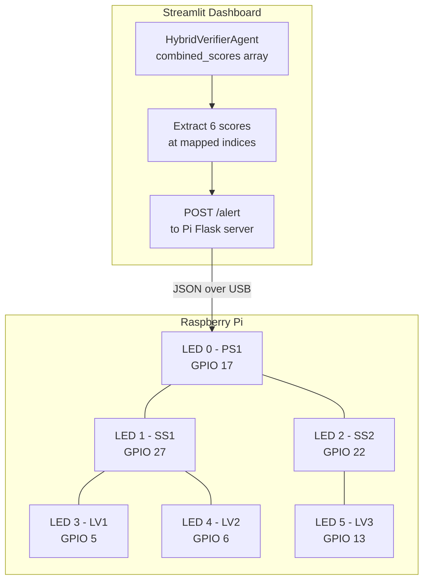

# Additional Diagrams

Mermaid diagrams for documentation reference. The system architecture and grid topology diagrams are in [README.md](../README.md).

---

## Hybrid Verifier Cascade

Three-layer verification ensemble with early-exit.

---

## Self-Play Loop

Propose-solve-verify training cycle with reward feedback.

---

## LED Board Mapping

6 physical LEDs mapped to a subtree of the SSEN grid for the viva demo.

The Pi runs a Flask server on `raspberrypi.local:5050`. The dashboard extracts per-node scores from `details._breakdown.combined_scores` at the 6 mapped graph indices, thresholds them (off / warn / alert), and sends the state as JSON. The cascade demo animates LV -> SS -> PS propagation matching the 2-hop BFS with 0.7 decay from `CascadeLogicLayer`.
